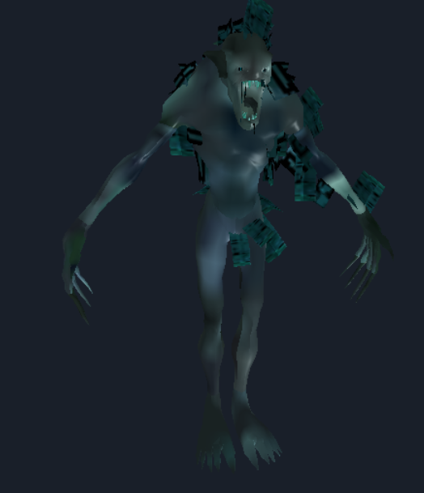

# Fable 2 Asset Browser

Browse and export a variety of Fable 2 files. Included features:

- Search and filter the internal files in the .bnk files
- Export all of the assets.
- Preview and export all .mdl files in global_models.bnk.
- Exports Audio files in a usable format. 
- Textures can be reconstructed when extracted. Useful for researching the compressed mipmaps (comp flag 1). Textures can be previewed in the hex view.
- And more!

Preview .mdl files in the browser. (Select a .mdl, go in to the hex view, then click preview).

_Hello cutie._

And now provides details on .mdl files:

Hex editor will provide useful information without needing to export or use external applications.

Pixel format 28 is not rendering correctly. Some textures don't load the hex, either. 

How to use:
- Rip a legitimate copy of Fable 2 to your PC.
- Download Fable 2 asset browser from releases and run it.
- To export as GLB, select a .mdl file, then click "convert to glb" (currently not working due to the update to C++).

Credits:
1. ResHax with help researching the .mdl file format. Especially H3x3r for continuously helping with the .tex format.
2. Fable 2 modding community for the resources that were available, giving me a good head-start.
3. Work, for not breathing down my neck when I have free time to work on this.
4. Odarenkoas on Discord for making the original decoder for .wav files. I bastardized his batch file to do it.
5. Dr. Cubed for sharing his repository detailing .bnk ver 2 (such as non-English speech.bnk).
